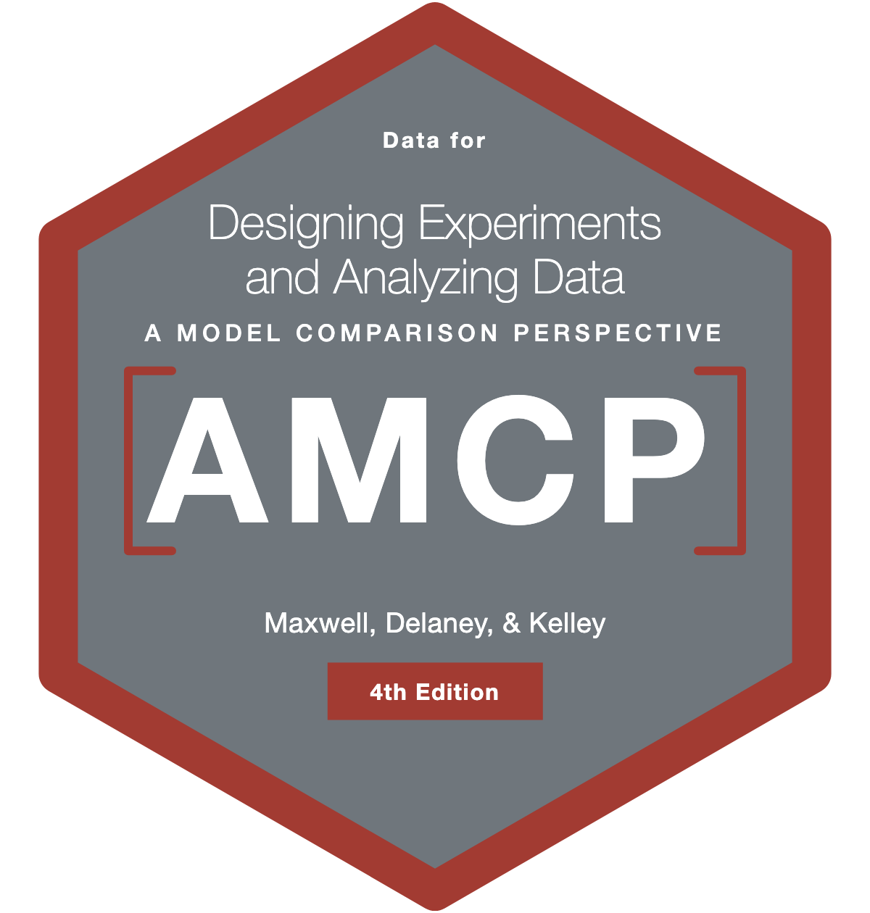

# AMCP 

AMCP provides all of the data sets used in Maxwell, Delaney, & Kelley's *Designing Experiments and Analyzing Data: A Model Comparison Perspective* (Routledge). There are no functions in this package — it contains data only.

**The package's major version tracks the edition of the book: AMCP 2.x is for the book's 4th edition (Maxwell, Delaney, & Kelley, 2027), and AMCP 1.x is for the book's 3rd edition (2018).**

## Installation

Install the current release (AMCP 2.x, for the book's **4th edition**) from CRAN:

```r
install.packages("AMCP")
```

If you are using the book's **3rd edition (2018)**, install the last 1.x release from CRAN instead, which ships the data as distributed with that edition:

```r
# install.packages("remotes")
remotes::install_version("AMCP", version = "1.0.2")
```

## Related software

We recommend the **DMAR** package as the companion for carrying out the book's analyses — install it with:

```r
install.packages("DMAR")
```

The book itself illustrates these analyses using the **MBESS** package, which you can use as well.

## More information

The book's companion website is at <https://designingexperiments.com>.
